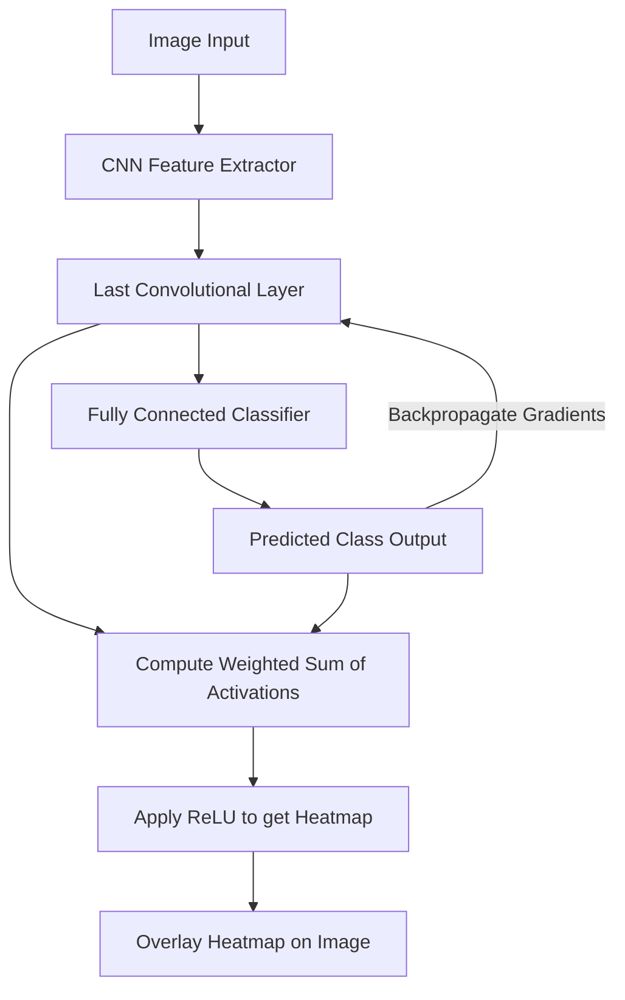

# 👁️ Computer Vision (Image-Based) XAI

Image-based explainability tools are tailored to extract intuitive explanations from computer vision models by identifying spatial features or pixels that drive classifications.

## 📊 Conceptual Overview

Vision explainability helps humans understand:
- Which object features triggered the classification (e.g., cat ears, wheels).
- Whether the model is focusing on background noise or the actual object.
- Pixel-level contributions and regional activations.

## 🛠️ Typical Workflow & Diagram

Here is a diagram of the **Grad-CAM** workflow:

## 📈 Key Examples

1. **Grad-CAM:** Generates activation heatmaps on chest X-rays to highlight lung tissue regions pointing to pneumonia.
2. **Saliency Maps:** Visualizes pixel importance for autonomous vehicle object detection.

## ⚖️ Pros & Cons

| Pros | Cons |
| :--- | :--- |
| Visually intuitive and easy for domain experts (like doctors) to verify. | Saliency maps can be noisy and sensitive to small perturbations. |
| Helps uncover data leakage (e.g., model looking at hospital labels on X-rays). | Does not capture complex feature combinations well. |
| High-level alignment with human visual perception. | Interpretability is often qualitative rather than quantitative. |
