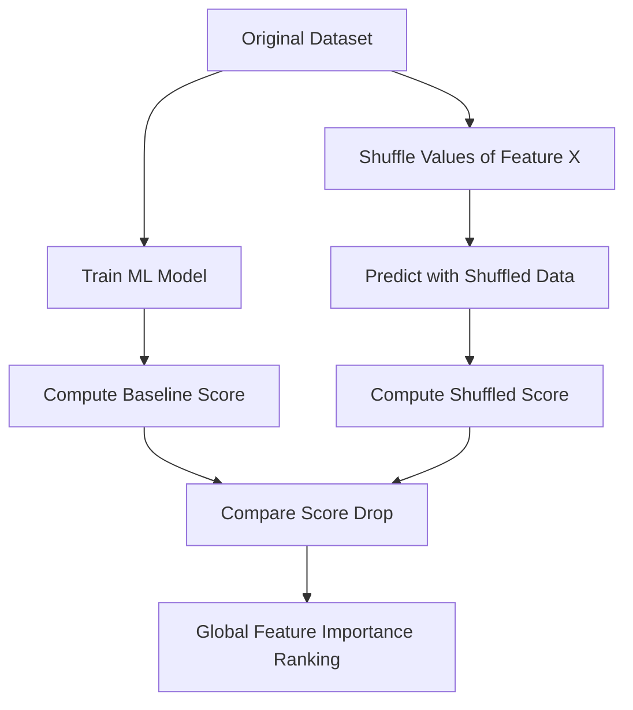

# 🌐 Global Explainability

Global explainability aims to describe the overall behavior of a machine learning model across the entire dataset. Instead of explaining a single prediction, it provides insights into what rules, patterns, or features the model generally relies on.

## 📊 Conceptual Overview

In global explainability, we treat the model holistically. We ask questions like:
- Which features are the most important overall?
- How does changing a feature's value affect the model's predictions on average?
- What is the general structure of the decision boundary?

## 🛠️ Typical Workflow & Diagram

Here is a diagram representing how **Permutation Feature Importance** (a global explainability technique) is computed:

## 📈 Key Example: Random Forest Feature Importance

In a Random Forest credit-scoring model, global explainability shows that "Debt-to-Income Ratio" and "Credit History Length" are universally the top factors across all applicants. 

## ⚖️ Pros & Cons

| Pros | Cons |
| :--- | :--- |
| Provides a bird's-eye view of the model's logic. | Can obscure local anomalies or specific exceptions. |
| Helps build high-level trust with regulators and stakeholders. | Can be computationally expensive for complex models. |
| Useful for overall feature selection and debugging. | Doesn't explain *why* a specific user was rejected. |
