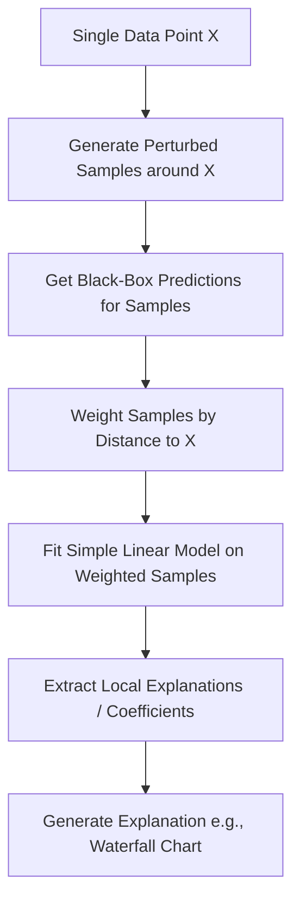

# 📍 Local Explainability

Local explainability zooms in on a single data point to explain why the model made a specific decision for that particular instance.

## 📊 Conceptual Overview

In local explainability, we explain the reasoning behind a singular prediction. We ask:
- Why was this specific applicant denied a loan?
- Which features pushed the prediction away from the average baseline for this person?
- What minimal change in features would change the decision? (Counterfactuals)

## 🛠️ Typical Workflow & Diagram

Here is a diagram showing how local explanation methods (like LIME or SHAP) analyze a single prediction:

## 📈 Key Example: Waterfall Charts for Credit Denials

For a loan applicant rejected by the system, local explainability creates a **Waterfall Chart** revealing that although their income was healthy (+0.1 to score), their "Recent Missed Payments" (-0.5 to score) pulled them below the threshold.

## ⚖️ Pros & Cons

| Pros | Cons |
| :--- | :--- |
| Explains decisions case-by-case, which is essential for user-facing applications. | May not represent the overall logic of the model. |
| Enables the "right to explanation" for individuals (e.g., GDPR). | Explanations can change slightly with different perturbations. |
| Highlights edge cases where the model might make unexpected errors. | Generating explanations for millions of items is slow. |
