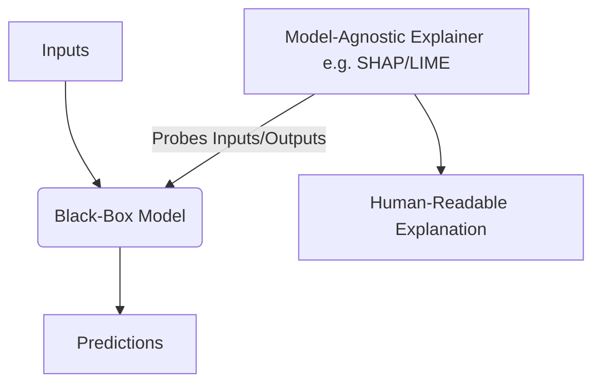

# 🤖 Model-Agnostic (Post-Hoc) Explainability

Model-agnostic post-hoc explainability refers to applying external interpretability tools to complex "black-box" models (like Neural Networks or Transformers) after training is complete.

## 📊 Conceptual Overview

Agnostic methods treat the model as a black box—only reading inputs and outputs. This allows practitioners to:
- Use any high-accuracy model they want.
- Apply the same explanation framework (e.g., SHAP, LIME) across multiple different models.
- Decouple the model choice from the explanation choice.

## 🛠️ Typical Workflow & Diagram

Here is a diagram representing how model-agnostic tools interact with any model:

## 📈 Key Examples

1. **SHAP (Shapley Additive exPlanations):** Explaining ensemble gradient boosting models using cooperative game theory.
2. **LIME (Local Interpretable Model-agnostic Explanations):** Learning local surrogate models around individual predictions.

## ⚖️ Pros & Cons

| Pros | Cons |
| :--- | :--- |
| Can be applied to ANY machine learning model. | Explanations are approximations of the black box, not exact representations. |
| Consistent explanation interface across different projects. | Can be computationally expensive due to repeated model evaluation. |
| Allows updating the underlying model without changing the explainer. | Can generate inconsistent explanations for similar data points. |
