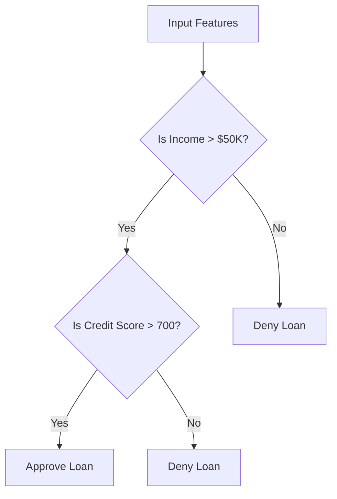

# 🔎 Model-Specific (Intrinsic) Explainability

Model-specific (or intrinsic) explainability relies on using "glass-box" models that are inherently transparent due to their simple mathematical structure.

## 📊 Conceptual Overview

In intrinsic explainability, the model's design itself is the explanation. We do not need an external post-hoc tool because:
- The parameters directly represent feature influence (e.g., linear coefficients).
- The decision boundary can be visualized and followed manually (e.g., decision trees).
- The model uses explicit logical rules.

## 🛠️ Typical Workflow & Diagram

Here is a diagram representing the transparent structure of a Decision Tree:

## 📈 Key Examples

1. **Decision Tree Diagrams:** Trace patient symptoms through a visible flowchart of IF-THEN rules.
2. **Linear Regression Coefficients:** Real estate models where every additional square foot mathematically adds exactly $150.

## ⚖️ Pros & Cons

| Pros | Cons |
| :--- | :--- |
| Highly transparent; the explanation is exact and not approximated. | Often suffers from lower accuracy/capacity on complex tasks (e.g., computer vision). |
| Easy to audit and understand without complex external tools. | Tree complexity grows exponentially, making large trees uninterpretable. |
| Computationally efficient to explain since it is built-in. | Restricts the developer's choice of algorithms. |
