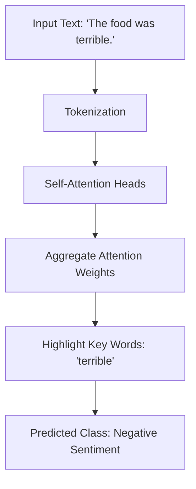

# ✍️ Natural Language Processing (Text-Based) XAI

Text-based explainability tools are designed to extract explanations from NLP models, highlighting key words or phrases that dictated the output.

## 📊 Conceptual Overview

For text models, explainability answers:
- Which tokens or words most heavily influenced the sentiment/classification?
- What relationship between distant words did the model pay attention to?
- What alternative input text would have yielded a different prediction? (Counterfactuals).

## 🛠️ Typical Workflow & Diagram

Here is a diagram representing **Attention Visualization** in transformer architectures:

## 📈 Key Examples

1. **Attention Rollout:** Visualizes attention flow in transformer architectures to see which keywords caused a support ticket escalation.
2. **Counterfactual Explanations:** Explains how changing minor keywords changes the rating or automated resume filter decision.

## ⚖️ Pros & Cons

| Pros | Cons |
| :--- | :--- |
| Direct mapping back to original text tokens makes debugging easy. | Attention weights do not always correlate perfectly with feature importance. |
| Excellent for uncovering biases in language models. | Large texts can lead to visual clutter and be hard to interpret. |
| Enables simple interactive testing of text modifications. | Relies heavily on language-specific tokenization pipelines. |
